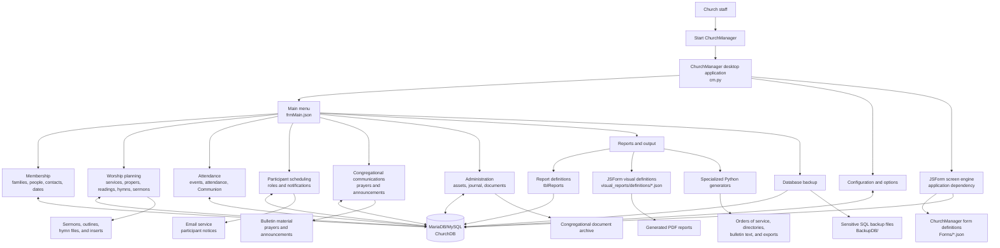

# ChurchManager Application Documentation

## Document purpose

This document describes only the ChurchManager desktop application contained in this repository. It is intended to serve four audiences:

- church staff using the application;
- an administrator installing or maintaining it;
- a developer changing forms, reports, or program behavior; and
- a future custodian who needs to understand how the application and its data fit together.

This is not documentation for the JSForm framework. JSForm is mentioned only where its role is necessary to install, operate, troubleshoot, or maintain ChurchManager.

This guide reflects the ChurchManager source and form definitions present in August 2026. ChurchManager is a working, locally developed system, and some older files remain alongside newer implementations. When documentation and code differ, the active ChurchManager Python source and current ChurchManager JSON form definitions determine actual behavior.

> **Privacy warning:** ChurchManager handles membership, contact, attendance, and pastoral information. Database dumps, generated reports, OAuth files, and congregational documents must be treated as confidential records. Historical database copies can still contain financial and donor records even though those features have been removed from the application.

Group secretaries can print **Groups - Attendance Sheet** from Reports. Select
the Group and use Start Date as the meeting date. The sheet lists members whose
membership is active on that date, provides attendance and note columns, and
adds blank visitor lines. Restricted Groups remain limited to authorized users.

## 1. Application overview

ChurchManager is a Windows desktop application for managing the administrative and worship life of a congregation. It was written in Python by Rev. Jonathan C. Watt and uses:

- wxPython for its graphical interface;
- MariaDB/MySQL for persistent data;
- the companion JSForm framework for JSON-defined data-entry forms;
- the JSForm visual report system and PDF renderer for formatted reports;
- FPDF and custom Python scripts for some specialized output; and
- Google Calendar and email integrations for selected workflows.

The application covers these broad functional areas:

1. Congregation and membership records
2. Worship planning and service records
3. Sermons, readings, propers, hymns, and orders of service
4. Attendance and Communion recording
5. Participant scheduling and notification
6. Prayers and announcements
7. Assets, journals, documents, and worship preparation checklists
8. Reports and database backups

ChurchManager is not a web application. It runs as a local Windows program and connects across the local network to the ChurchDB database server.

The supported local interpreter is the project-owned `.runtime-venv`. Both
launchers call its Python executable directly and first verify that wxPython,
MariaDB, and JSForm can be imported. Direct dependencies are pinned in
`requirements-runtime.txt`; the older `.venv` is no longer used because its
base Python installation was removed from the computer.

## 2. System architecture

ChurchManager consists of four primary layers:



The main menu is the operational hub. Most functional screens read from and
write to ChurchDB. Reporting combines approved database datasets with JSForm
visual definitions or specialized Python generators. Email, generated
documents, filesystem archives, and database backups leave the central database
flow and therefore require separate security and retention controls.

### 2.1 Main application

`cm.py` is the application entry point and remains a JSForm application. Startup
is guarded by `main()`, so tests and maintenance tools can import ChurchManager
without opening the graphical application or connecting to a database. The
startup sequence is composed in `startup.py` and stored in an explicit
`ApplicationContext`.

At runtime the dependency direction is:

```text
ChurchManager workflows and menu actions
    -> ChurchManager services and form factory
        -> JSForm public form, database, and reporting APIs
            -> wxPython, MariaDB, and the JSForm PDF renderer
```

ChurchManager has not replaced JSForm. `ChurchManagerFormFactory` creates the
application's `clsForm`, which is still a subclass of `JSForm.clsForm`. Form
definitions, record navigation, configuration, options, fonts, database-backed
controls, and catalog reports continue to be supplied by JSForm.

JSForm also provides an incremental responsive-layout mode. Migrated forms use
wxPython sizers and scrolling rather than final pixel coordinates, while
unmigrated definitions continue to use the legacy positioning path. Person,
Family, and Sermon are the initial ChurchManager forms enabled for responsive
layout.

JSForm automatically selects that responsive path for structurally safe forms
and preserves `StaticBox` sections with nested sizers. The former Check Register
and the rest of the unfinished financial form set have been removed.

During startup ChurchManager:

- reads database connection arguments;
- creates the wxPython application;
- checks internet connectivity;
- opens the database connection;
- initializes JSForm configuration, options, and fonts;
- creates the main menu from `Forms/frmMain.json`;
- binds main-menu labels to forms and custom actions; and
- enters the wxPython event loop.

Application-specific orchestration is separated into small modules:

- `main_menu.py` declares the menu-to-form routes;
- `form_factory.py` consistently creates JSForm-backed ChurchManager forms;
- `backup_service.py` creates backups without exposing a password in the
  process command line;
- `report_service.py` routes catalog reports through JSForm and launches
  specialized generators;
- `report_support.py` contains import-safe shared report setup; and
- `fnSchedule.py` sends notifications to active participants from normalized
  worship assignments.

`cm.py` defines an application-specific `clsForm` subclass. This subclass extends JSForm behavior for operations such as:

- searching the hymn catalog;
- adding hymns to a service;
- adding database IDs to sermon and outline filenames;
- recording attendance and Communion participation;
- selecting and running reports; and
- handling linked application actions.

### 2.2 Form engine dependency

ChurchManager uses the neighboring `JSForm` package as its screen and database form engine. ChurchManager supplies its own JSON screen definitions in `Forms`, while JSForm turns those definitions into working Windows forms with database navigation and saving. JSForm is an application dependency rather than a functional area of ChurchManager.

Maintainers changing a ChurchManager screen can consult [form.documentation.md](form.documentation.md) for the JSON properties recognized by that dependency. Ordinary ChurchManager users do not need to understand JSForm.

### 2.3 ChurchManager database

The primary database is `ChurchDB`, hosted in MariaDB/MySQL. Application forms normally correspond to a table or view and expect an integer field exposed as `ID`.

The installed form engine also requires its support configuration to be available. This is an installation dependency; ChurchManager's congregation and ministry records remain in ChurchDB.

### 2.4 ChurchManager reports and document generation

Formatted database reports use JSON definitions in `visual_reports/definitions`,
approved dataset providers, and JSForm's PDF renderer. Report metadata,
permissions, and required parameters are stored in `tblReports`.

Other output is created by dedicated Python scripts, including:

- Sunday announcements;
- Sunday prayers;
- orders of service;
- membership directories; and
- an unfinished historical donor-acknowledgment export prototype.

## 3. Repository layout

| Path | Purpose |
| --- | --- |
| `cm.py` | Main ChurchManager application and menu dispatch. |
| `ChurchManager-Test.pyw` | Windowless development/test launcher; requires a locally rebuilt `.runtime-venv`. |
| `ChurchManager-Test.bat` | Diagnostic development launcher that intentionally keeps a console visible. |
| `Forms/` | JSON definitions for application screens. |
| `visual_reports/definitions/` | Starter definitions for supported visual reports. |
| `Documentation/` | Application and form documentation. |
| `assets/` | Source artwork and other application-owned static assets. |
| `migrations/` | Versioned ChurchDBTest schema migrations. |
| `tests/` | Active automated ChurchManager tests. |
| `tools/` | Maintained development and report-conversion tools. |
| `visual_reports/` | ChurchManager integration for the JSForm visual report system. |
| `schema/` | JSON Schema used or considered for validating ChurchManager form definitions. |

Congregational administrative documents are stored in `C:\Users\Pastor\Documents\Church Documents`. Historical database dumps are stored in `D:\Backup.ChurchManager\DatabaseArchive`.

## 4. Requirements

### 4.1 Supported environment

The checked-in launcher and process calls are Windows-specific. The application assumes:

- Windows;
- a compatible Python 3 installation;
- wxPython;
- network access to the MariaDB/MySQL server;
- the sibling JSForm project available to Python as `JSForm`; and
- the JSForm reporting dependencies listed in `requirements-runtime.txt`.

The current `requirements.txt` records historical package versions. Its important packages include:

- `wxPython`
- MariaDB and MySQL connectors
- `lxml`
- `Pillow`
- `fpdf`
- `premailer`
- `requests`
- `yagmail`
- Google authentication dependencies used by calendar integration

The repository's `.venv` is tied to the machine on which it was created. A new machine should receive a newly created virtual environment rather than copying the existing one.

### 4.2 External services and applications

Depending on the features used, ChurchManager requires:

- MariaDB/MySQL server containing ChurchDB;
- a PDF viewer;
- Microsoft Word for some order-of-service and document conversion workflows;
- Google Calendar API credentials and authorization token; and
- protected email configuration using JSForm's SMTP transport and Windows
  Credential Manager; test mode cannot send email.

## 5. Installation and initial setup

### 5.1 Required application directory arrangement

The current installation expects ChurchManager and JSForm to be sibling directories:

```text
Documents/
    ChurchManager/
    JSForm/
```

ChurchManager requires this sibling package to start. Python must be able to import the `JSForm` directory. If ChurchManager is moved, update the Python path or install that dependency into the active environment.

### 5.2 Create a virtual environment

From the ChurchManager directory, create and activate a fresh Python environment, then install the required packages from `requirements.txt`. wxPython and database connector compatibility should be verified against the selected Python version.

### 5.3 Prepare the database

Create or restore the ChurchDB database using an approved current backup. The `SQL` directory contains table definitions and historical exports, but it is not a single guaranteed migration sequence. A recent verified database dump is normally the safest source for an existing installation.

The database account should:

- be dedicated to ChurchManager;
- have only the permissions required to read and update ChurchDB;
- not be a server administrator; and
- be restricted to approved hosts or the local network.

### 5.4 Configure paths

ChurchManager and JSForm read path and formatting values from `tblConfig`. Common configuration entries include:

| Configuration | Purpose |
| --- | --- |
| `Location/Form` | JSON form directory. |
| `Location/Picture` | Pictures directory. |
| `Location/Report` | Generated-report directory. |
| `Location/MySQLDump` | Directory containing `mysqldump`. |
| `Location/DBBackup` | Destination for database dumps. |
| `Location/Sermon` | Sermon directory. |
| `Location/Outline` | Outline directory. |
| `Location/JSONSchema` | Form-schema directory. |
| `Format/Date` | Date display format. |
| `Format/Time` | Time display format. |
| `Format/DateTime` | Combined date/time display format. |

Exact entries depend on the current database. Use the Config screen to inspect installed values.

### 5.5 Configure the launcher

`ChurchManager-Test.pyw` changes to the application directory, verifies the
project runtime, and starts `cm.py` with guarded test-database arguments.

```text
python cm.py --server SERVER --database ChurchDB --user USER
```

For an isolated test session, run `ChurchManager-Test.pyw` or add `--test` to
the command. Test mode ignores the normal database name and uses the database
configured at `testing.database` in `churchmanager.json`. The main window title
clearly displays `TEST MODE`, and ChurchManager refuses to start if the test and
production database names match. The framework configuration connection also
uses `testing.jsform_database` (`JSFormTest`) instead of the production `JSForm`
database.

Visual report definitions do not embed a database login. Test mode builds
datasets from `ChurchDBTest`; production mode uses the explicitly configured
production database. Definitions therefore require no environment-specific
rewriting or temporary credential-bearing copy.

Supported command-line options are:

| Short | Long | Meaning | Default |
| --- | --- | --- | --- |
| `-s` | `--server` | Database server name or address. | `localhost` |
| `-d` | `--database` | Application database. | `ChurchDB` |
| `-u` | `--user` | Database username. | None |

Database passwords are retrieved from Windows Credential Manager using the
`ChurchManager/Production` and `ChurchManager/Test` entries. They are not stored
in the launcher or `churchmanager.json`.

### 5.6 Verify startup

Before regular use, verify that:

1. ChurchManager opens without a Python error.
2. The main menu is displayed.
3. A simple data screen such as Church or Person opens.
4. Navigation displays existing records.
5. A non-destructive report can be generated.
6. The report opens from the configured Reports directory.
7. A test backup completes and produces a nonempty SQL file.

## 6. Starting and closing ChurchManager

### Starting

Run `ChurchManager-Test.pyw` from Windows. At startup the application:

1. parses database arguments;
2. initializes wxPython;
3. performs an internet-connectivity check;
4. connects to ChurchDB and the JSForm support database;
5. loads configuration, options, and font settings; and
6. opens the main menu.

The connectivity check is performed before the main screen appears. In some JSForm versions it continues retrying until internet access succeeds, even though many local database operations do not inherently require the public internet.

### Closing

Use the Close button or the window close control. When a form has unsaved changes, JSForm may ask whether to continue or cancel closing. Review and save important changes before leaving the form.

## 7. General form operation

Most data screens use standard navigation controls:

| Control | Function |
| --- | --- |
| New | Begins a blank record. |
| Update | Saves the current record. |
| Delete | Deletes the current record after the relevant application handling. |
| First | Moves to the first selected record. |
| Previous | Moves to the previous record. |
| Next | Moves to the next record. |
| Last | Moves to the final selected record. |
| Close | Closes the screen. |

Important operating principles:

- Values are not necessarily saved merely by leaving a field; use Update.
- Required fields are checked before saving.
- Related buttons may open a linked screen filtered to the current record.
- New linked records may automatically receive their parent ID.
- Read-only fields identify values controlled by the application or parent record.
- Deleting a record may affect linked data and should be done cautiously.

## 8. Functional areas

### 8.1 Congregation setup

The Church screen maintains the congregation record used by other tables and reports. Church information provides the organizational context for services, people, worship planning, attendance, and reports.

Related tables include:

- `tblChurch`
- `tblChurchInfo`
- `tblConfig`
- `tblOptions`
- `tblChoices`

Configuration screens should be restricted to an administrator familiar with the application because incorrect path, format, or choice values can affect many forms.

### 8.2 Families and people

Membership data is divided between family-level and person-level records.

Family records can link to:

- family addresses;
- family contacts;
- family dates;
- family visits; and
- individual people belonging to the family.

Person records can link to:

- personal addresses;
- personal contact information;
- dates such as birth, Baptism, confirmation, reception, transfer, or other milestones;
- membership status; and
- notes.

Key tables include:

- `tblFamily`
- `tblFamilyAddress`
- `tblFamilyContact`
- `tblFamilyDate`
- `tblFamilyVisit`
- `tblPerson`
- `tblPersonAddress`
- `tblPersonContact`
- `tblPersonDate`

The directory and contact reports normally honor fields such as directory inclusion and unlisted address/contact settings. Verify those flags before distributing a directory.

The **Data Management** screen provides a guarded duplicate review and a
schema-derived, read-only merge-impact preflight for people
and families. It identifies conservative candidate matches within the same
church, such as identical names, contact values, or mailing addresses. A match
is advisory: ChurchManager does not automatically combine, delete, or alter
records. Later import and merge work must preserve that review-first boundary.
Its CSV preview accepts People or Families files with a header row, requires
explicit destination-field mappings, and displays the interpreted records
without opening a database transaction. Preview and import are intentionally
separate operations.
After a clean preview, reviewed import requires an explicit confirmation and
creates all rows in one database transaction. Import history retains attribution,
counts, the source file name, and its SHA-256 checksum without retaining the CSV
contents. Existing-name or contact conflicts block the operation for review.
Privacy-safe export produces one People or Families CSV for a selected church.
Its queries exclude every address or contact marked unlisted and expose only
the approved directory columns. The system records attribution, row count,
destination file name, and checksum without retaining exported content.

### 8.3 Worship services

The Service screen records scheduled worship services. A service record connects the date and time with the congregation, propers, order of service, hymns, readings, sermon, attendance, and serving participants.

Key tables include:

- `tblService`
- `tblServiceRole`
- `tblPropers`
- `tblReading`
- `tblBulletinOrderTemplate`
- `tblBulletinOrderLine`
- `tblServiceBulletinOrder`
- `tblServiceBulletinOrderLine`
- `tblHymnUsage`
- `tblSermon`

A typical service-planning workflow is:

1. Confirm the Church record.
2. Create or select the appropriate Propers record.
3. Create the Service record and select its Order of Service template.
4. Apply the propers to fill readings and suggested hymns into the weekly order.
5. Review and complete the weekly Order of Service.
6. Link or create the sermon and outline files.
7. Fill the template's required participant positions and add any service-specific assignments.
8. Review the Worship Planning report.
9. Notify participants.
10. Generate the order of service.
11. After worship, create the attendance event and record attendance.

### 8.4 Propers and readings

Propers represent the appointed liturgical information for a Sunday, feast, festival, or other service. They can supply readings and seasonal data used by scheduling and worship output.

Reading screens maintain biblical references used to fill the weekly Order of Service. A weekly reading may be overridden directly when a service needs a different selection.

Because report and order-of-service scripts rely on positional fields in some queries, changes to table column order or `SELECT *` behavior require careful regression testing.

### 8.5 Hymns and hymn usage

Hymn identity is permanent. Each registered hymnal owns a fixed 5,000-number
block; the LSB block is 10,001-14,999 and congregation-owned entries use
5,001-9,999. Printed hymn numbers remain display metadata rather than database
keys. Packaged and historically used hymns are retired instead of physically
deleted. Hymnal packages contain catalog metadata only and never include lyrics,
music, notation, recordings, or publisher artwork.

The hymn subsystem includes:

- hymnal records;
- hymn numbers and titles;
- biblical references, categories, notes, and files;
- hymn searching; and
- historical hymn usage by service.

The custom search screen can search by hymn number, title, Bible text, category, or note. A selected hymn can be added to a service with a `UsedAs` value describing its liturgical role.

Hymn usage reports can show usage by service, by hymn, for a selected hymn, or since a selected date.

### 8.6 Sermons and outlines

Sermon records associate sermon metadata and files with worship services. ChurchManager can rename a selected sermon or outline file by appending its database ID in the form:

```text
Original Name.ID(123).docx
```

This creates a durable connection between the database record and filesystem artifact. The configured Sermon and Outline paths must be correct, and the application must have permission to rename files there.

`sermon2blogger.py` is a separate utility that converts Word sermon documents to plain text or Blogger-oriented content. Older `.doc` files may be converted to `.docx` using Microsoft Word automation.

### 8.7 Orders of service

Reusable Order of Service templates are maintained through Bulletin Order Templates. Each template owns its ordered lines, optional hymnal, and normal required participant positions. Customized copies may be edited; starter templates remain protected.

The generator combines outline metadata such as:

- order-of-service lines and headings;
- short planning labels;
- hymn titles and printed references;
- readings and references;
- propers; and
- service-specific selections.

The Worship Service screen combines the selected template with that week's readings, hymns, and service-specific values. It saves a weekly outline that can be previewed or exported as plain text. The output is an outline for insertion into a bulletin, not a complete service text.

This is a structural boundary, not a licensing option. Order of Service packages,
database records, customized templates, weekly copies, and generated output must
not contain fields or attachments for full liturgical wording; complete prayers or
collects copied from publications; responsive pastor-and-congregation text;
meaningful-length verbatim rubrics; psalm or canticle text; psalm tones or musical
settings; hymn lyrics; music notation; accompaniment material; or publisher
artwork or page images. The schema is limited to sequence, short outline labels,
item types, references, conditions, inclusion choices, and brief planning notes.

### 8.8 Prayers

Prayer records support start and end dates and week-of-month flags. The Sunday Prayers action determines the current date, calculates whether it is the first through fifth occurrence within the month, selects prayers active for that date and week, and generates output.

`churchmanager.json` contains a testing override date. If `testing.override_today` is set to an ISO date such as `2026-08-09`, prayer and announcement scripts use that date instead of the system date. Production use should normally leave it `null`.

### 8.9 Announcements

Announcement records similarly support active date ranges and first-through-fifth-week selection. Sunday Announcements selects records that:

- are enabled for normal display;
- have started or have no start date;
- have not ended or have no end date; and
- match the calculated week of the month.

The application includes both the normal Announcement screen and an Announcement Kiosk form.

### 8.10 Participant scheduling

Participants may link to congregation members or remain independent outside participants. They have contact information, eligible roles, availability patterns, and notes. Availability can be restricted by:

- service time;
- day of week;
- month;
- liturgical season; and
- participant role.

The selected Order of Service template defines the normal number of people required for each position. The Service Participants screen displays every required slot, including open positions, and allows additional service-specific assignments. Manual assignments are authoritative. Preview Suggestions fills only open required slots using eligible, available participants and never replaces existing assignments. All accepted suggestions are saved together as one database transaction.

Declined assignments remain visible for planning and reporting but do not fill a required slot. The Worship Planning report includes required, open, assigned, suggested, confirmed, declined, and additional positions.

### 8.11 Participant notification

Notify Participants retrieves the selected service's scheduled participants, gathers available email addresses, and sends a message with the configured worship-planning PDF attached.

Before sending:

1. Generate and review the worship-planning report.
2. Confirm participant assignments.
3. Confirm recipient email addresses.
4. Verify the attachment path and report filename.
5. Verify email credentials and sender configuration.

Email sending is an external action. Once sent, it cannot be recalled by ChurchManager.

### 8.12 Attendance and Communion

Attendance uses two levels:

- an attendance event describing the service or gathering; and
- individual attendance rows connected to that event.

The Record Attendance form displays member and visitor selections. It creates `tblAttendance` records containing the person ID, attendance-event ID, and Communion status. Communion is recorded in relation to whether Communion was offered at that event.

Recommended workflow:

1. Create or select the Attendance Event.
2. Indicate whether Communion was offered.
3. Open Record Attendance.
4. Select attendees.
5. Mark communicants where appropriate.
6. Save and verify the attendance report.

Attendance and Communion records are sensitive pastoral data. Access and distribution should be limited appropriately.

### 8.13 Financial and donor subsystem — removed

The unfinished accounting, giving, envelope, donor, and gift features were
removed from ChurchManager in August 2026. Their menu controls, form definitions,
posting scripts, report templates, and donor-acknowledgment export are no longer
part of the application.

Historical financial and donor tables and records remain in existing databases
for preservation. ChurchManager does not expose or use them. Removing those
tables or their data requires a separate, explicitly approved database migration.

### 8.15 Assets, journals, and documents

The Asset screen records church assets. The Journal screen records dated narrative entries and supports date-range reporting. The Document screen catalogs files or document metadata. The former generic Projects and Tasks subsystem was retired because focused ministry workflows now cover the active planning needs.

Key tables include:

- `tblAsset`
- `tblJournal`

The repository's `Documents` directory is a filesystem archive and is not identical to the database's Document catalog. Moving or renaming cataloged files may break stored file references.

### 8.16 Checklists

Checklist forms provide reusable or record-specific task lists. Development
work is maintained in the repository roadmap and issue tracker; the former
database-backed enhancement tracker has been retired.

## 9. Reports

### 9.1 Report process

The Reports screen reads report definitions from `tblReports`. A report definition contains:

- report code;
- title;
- required parameter names;
- optional batch members; and
- notes.

When a report is selected, the form enables the controls named in its parameter
list. Running the report builds an approved dataset, resolves the customized or
starter JSON definition, and passes both to JSForm's PDF renderer. Unknown or
retired report codes fail closed.

Common parameters include:

- `ChurchID`
- `ServiceID`
- `PersonID`
- `HymnID`
- `HymnalID`
- `AttendanceType`
- `Detail`
- `StartDate`
- `EndDate`

### 9.2 Documented report catalog

The installed SQL report data includes the following reports. The database currently in use may contain additions or updated codes.

| Code | Report |
| --- | --- |
| `CMPR01` | Prayer Requests |
| `CMWP01` | Worship Planning Worksheet |
| `CMFD01` | Congregation Family Directory; the corresponding template is absent from the current pattern directory and may have been retired or renamed. |
| `CMPH02` | Member Contact Listing |
| `CMHU01` | Hymn Usage by Service |
| `CMHU02` | Hymn Usage by Hymn |
| `CMPE01` | Transfers |
| `CMWS01` | Worship Services by Date |
| `CMHU03` | Hymn Usage for a selected hymn |
| `CMML01` | Member Status List |
| `CMML02` | Member Date Listing |
| `CMML03` | Mailing Labels - Families (three-column label stock) |
| `CMML04` | Mailing Labels - Members (three-column label stock) |
| `CMCL01` | Family Listing; its template appears to have been renamed to `CMMD01`. Verify the database code before use. |
| `CMMI01` | One Member Information report |
| `CMMI02` | All Member Information listing |
| `CMMI03` | Member Update Forms |
| `CMHU04` | Hymn Usage Since a Date |
| `CMHU05` | Favorite Hymns for a selected hymnal |
| `CMAT01` | Attendance Event Listing |
| `CMJR01` | Journal report |
| `CMAS01` | Asset Listing |
| `CMBATCH00` | Pastor's Reports batch |

Additional templates currently present include attendance, membership, project,
prayer, and worship reports whose exact titles should be confirmed against the
live `tblReports` data. Removed financial and donor report codes are filtered from
the report menu even when historical `tblReports` rows remain in a database.

#### Favorite hymns

To mark a hymn as a favorite, open **Hymns** and include the whole tag
`#favorite` anywhere in its Note field. The tag is not case-sensitive and may
appear alongside an ordinary note. Remove that tag to remove the hymn from the
favorites list.

To print the list, open **Reports**, select **Favorite Hymns**, choose the
hymnal, and select **Run Report**. Only active hymns in the selected hymnal are
included. The report prints catalog metadata only: the hymn reference, title,
tune, category, and Scripture reference. It does not print lyrics or music.

### 9.3 Specialized reports

Some menu actions bypass the general Reports screen:

- Sunday Prayers runs `rptPrayers.py`.
- Sunday Announcements runs `rptAnnouncement.py`.
- Prepare Bulletin Order uses the structured weekly Order of Service.
- Member Directory uses `rptMemberDirectory.py` where the menu item is enabled.
- Prayer Requests uses the ordinary authorized visual-report pipeline.

### 9.4 Report troubleshooting

If a report fails:

1. Confirm the report exists in `tblReports`.
2. Confirm `visual_reports/definitions/<code>.json` exists and validates.
3. Confirm all requested parameter controls are enabled and populated.
4. Confirm the report code is in `OFFICIAL_CODES` and its dataset provider uses
   approved report-safe views.
5. Confirm the output directory is writable.
6. Confirm the output PDF is not open or locked.
7. Run the relevant view against a safe database client to verify it returns data.
8. Review Support Diagnostics and any terminal output.

## 10. Database overview

The following table groups the principal ChurchManager tables by purpose. The live database is authoritative; the `SQL` directory contains a mixture of schema files and historical dumps.

| Area | Principal tables |
| --- | --- |
| Congregation | `tblChurch`, `tblChurchInfo` |
| Framework configuration | `tblConfig`, `tblOptions`, `tblChoices`, `tblReports` |
| Membership | `tblFamily`, `tblFamilyAddress`, `tblFamilyContact`, `tblFamilyDate`, `tblFamilyVisit`, `tblPerson`, `tblPersonAddress`, `tblPersonContact`, `tblPersonDate` |
| Worship | `tblService`, `tblServiceRole`, `tblPropers`, `tblReading`, `tblBulletinOrderTemplate`, `tblBulletinOrderLine`, `tblServiceBulletinOrder`, `tblServiceBulletinOrderLine`, `tblSermon` |
| Hymns | `tblHymn`, `tblHymnal`, `tblHymnUsage` |
| Scheduling | `tblParticipant`, `tblParticipantRole`, `tblParticipantAvailability`, `tblWorshipRole`, `tblWorshipSchedulePattern`, `tblServiceRole` |
| Attendance | `tblAttendanceEvent`, `tblAttendance` |
| Communications | `tblPrayer`, `tblAnnouncement` |
| Preserved historical data not used by ChurchManager | Financial and donor tables retained pending a separately approved database migration |
| Administration | `tblChecklist`, `tblAsset`, `tblJournal`, `tblDocument` |

### Database conventions

- Editable tables normally have an auto-increment integer `ID`.
- Foreign keys are commonly represented by names such as `PersonID`, `FamilyID`, `ChurchID`, or `ServiceID`.
- Production and historical backups may still rely on application-enforced relationships and MyISAM tables.
- `ChurchDBTest` was migrated in August 2026 to InnoDB with explicit foreign keys. This test migration does not imply that production `ChurchDB` has been migrated.
- Several scripts select `*` and access columns by numerical position. Changing schema order can therefore break application logic even when field names remain unchanged.

Before changing the schema, search Python, JSON forms, report definitions,
dataset providers, and SQL views for every affected table and column.

## 11. Configuration and options

### ChurchManager configuration

`tblConfig` stores ChurchManager paths, display formats, and font values. Configuration changes affect ChurchManager screens and output and should be documented.

### ChurchManager options

`tblOptions` stores ChurchManager choices such as the last backup date and optional form-schema checking settings.

### ChurchManager shared choices

`tblChoices` supplies drop-down or checklist values for fields that do not define choices directly in JSON. Changing a shared choice may affect several screens and existing records.

## 12. Backups and restoration

### Creating a backup

The Backup DB main-menu action:

1. creates a timestamp;
2. reads the MySQLDump and DBBackup locations;
3. runs `mysqldump` against ChurchDB;
4. names the file `.ChurchDB.Backup.YYYY-MM-DD.HHMM.SQL`;
5. records the last backup date in application options; and
6. displays a completion dialog.

### Backup verification

A completion message proves that the process ended, not necessarily that the dump is usable. Regularly verify that:

- the file exists;
- it is not empty;
- it contains expected table definitions and records;
- it can be restored into a disposable database; and
- an additional encrypted copy is stored away from the application computer.

### Restoration

Restoration is not implemented as an ordinary ChurchManager button and should be performed by a qualified administrator.

Recommended procedure:

1. Stop ChurchManager on every workstation.
2. Preserve the current database with a new emergency dump.
3. Create a separate test database.
4. Restore the selected backup into the test database.
5. verify table counts and representative records.
6. Point a test configuration at the restored database.
7. Exercise the operational membership, worship, attendance, sermon, and report functions.
8. Only then schedule and perform the production restoration.

Never overwrite the only known copy of the current database during a restoration attempt.

## 13. Calendar and email integrations

### Google Calendar

`liccalendar.py` authorizes against Google Calendar, determines the next Sunday, and retrieves events related to the service week. Its OAuth client and token files are stored outside the project under `%LOCALAPPDATA%\ChurchManager\OAuth`.

OAuth files grant access and must not be committed, emailed, or stored with public source code. If exposed, revoke the authorization and issue new credentials.

### Email

Participant notification uses JSForm's SMTP wrapper. Ensure that:

- sender credentials are stored securely;
- the sender account permits the authentication method in use;
- recipient lists are reviewed before sending;
- confidential attachments are appropriate for all recipients; and
- failures are logged without revealing credentials.

## 14. ChurchManager developer and maintainer guide

### 14.1 Adding or changing a form

1. Identify the table or view and all required fields.
2. Create or edit `Forms/frmName.json`.
3. Keep the filename, root key (`frmNameFORM`), and form `name` consistent.
4. Give data-bound controls the same names as selected fields.
5. Define linked forms with parent conditions and `fillonblank` mappings.
6. Add the form to the main menu only if it requires direct access.
7. Bind custom actions in `cm.py` or the application `clsForm` subclass.
8. Test empty, single-record, and multi-record cases.
9. Test New, Update, Delete, and navigation.
10. Validate required fields and null values.

See [form.documentation.md](form.documentation.md) for the JSON reference.

### 14.2 Adding a main-menu item

The main menu is defined in `Forms/frmMain.json`, but a visible label alone does not open a form. A complete menu addition normally requires:

1. a `StaticText` or button control in `frmMain.json`;
2. a matching event binding near the end of `cm.py`; and
3. a matching `case` in `_buttonclick()` that either sets `formname` or runs a custom action.

Keep the control name identical across all three locations.

### 14.3 Adding a report

1. Define an approved dataset contract and report-safe data source.
2. Create and validate a JSON starter in `visual_reports/definitions` using a
   unique report code.
3. Register the specification in `visual_reports/report_inventory.py` and add a
   matching `tblReports` row through a numbered migration.
4. List parameter control names exactly as they appear on `frmReports`.
5. Confirm all required parameter controls exist.
6. Run the report with representative and empty data.
7. Verify output paths containing spaces.
8. Confirm sensitive fields are appropriate for the report's audience.

### 14.4 Adding custom behavior

Use ChurchManager's `clsForm` subclass for behavior associated with controls that can appear on several ChurchManager forms. Use a local handler inside `_buttonclick()` for a ChurchManager main-menu workflow.

Prefer:

- parameterized SQL queries;
- explicit field lists rather than `SELECT *`;
- meaningful exception messages;
- transactions for multi-row operations;
- configuration values rather than hard-coded paths; and
- argument arrays with `shell=False` for external processes.

### 14.5 Validation and testing

The project contains many exploratory scripts in `DevelopmentTesting`, but it does not currently present a unified automated application test suite.

Minimum verification for a release should include:

- parsing every JSON form;
- opening every main-menu screen;
- exercising record navigation;
- testing insert, update, and delete on a disposable database;
- testing linked forms and parent IDs;
- generating every active report;
- running participant scheduling on test data;
- generating prayers, announcements, and an order of service;
- testing a database dump and restoration; and
- reviewing logs for unhandled exceptions or sensitive values.

## 15. Security and privacy

ChurchManager distinguishes three related identities. `tblUser` is the login,
permission, and audit identity. It may optionally link to one `tblPerson`, but
users do not have to be congregation members and contact fields never
synchronize automatically. `tblParticipant` remains separate because worship
participants may also be members or outside people.

User Administration may explicitly send a welcome email containing the username
and first-login instructions. Temporary passwords must be communicated through
a separate channel and must never appear in email, logs, audit details, or
support packages.

### 15.1 Current risks requiring attention

The current repository contains or has contained:

- database credentials in source, configuration, and launcher files;
- Google OAuth client and token files;
- database backups containing private congregational data;
- congregation documents containing personal or organizational information; and
- subprocess commands that place passwords on the command line.

If this repository has been copied, synchronized to an untrusted service, or shared outside authorized custodians, assume the included credentials and tokens are compromised.

### 15.2 Required protections

- Rotate exposed database and OAuth credentials.
- Store secrets in Windows Credential Manager, environment variables, or a protected local file excluded from version control.
- Do not pass passwords in command lines; other local processes may be able to inspect them.
- Exclude OAuth tokens, client secrets, database dumps, logs, reports, and private documents from source control.
- Encrypt off-site backups.
- Restrict ChurchDB network access.
- If future remote desktop access is permitted, use a safely configured,
  encrypted, vendor-neutral VPN design. Never expose MariaDB or unrestricted
  remote-desktop access directly to the public internet.
- Use a least-privilege application account.
- Limit report distribution according to its contents.
- Establish a retention policy for attendance, Communion, membership, and pastoral records.
- Securely dispose of obsolete exports and backups.

### 15.3 SQL and process safety

Much of the current code constructs SQL and external commands through string formatting. Form descriptions and database content must therefore be treated as trusted input. Future modernization should replace value interpolation with parameterized SQL and replace shell command strings with validated argument lists.

## 16. Troubleshooting

| Symptom | Likely cause and response |
| --- | --- |
| ChurchManager does not start | Confirm the launcher directory, virtual environment, Python executable, and installed requirements. Start it from a terminal to see the error. |
| `ModuleNotFoundError: JSForm` | Ensure the sibling JSForm package is present and its parent directory is on Python's import path. |
| Database connection fails | Verify server reachability, MariaDB/MySQL service status, database name, credentials, account host permissions, and firewall rules. |
| Startup hangs before the menu | The internet-connectivity check may be retrying. Confirm network access or revise the check for offline local operation. |
| Form not found | Check `Location/Form`, the JSON filename, and the `<formname>FORM` root key. JSForm may also search its own Forms directory. |
| A field is blank | Confirm the control name matches a selected database field and the field is included in `table.fields`. |
| A list has no choices | Check literal `choices`, `lookupchoices`, or the matching `tblChoices` row. |
| Update fails | Check required fields, database permissions, field types, date formats, and terminal/log errors. |
| Linked form shows no records | Verify the parent has been saved and its ID is substituted into the linked form's condition. |
| New linked record lacks its parent ID | Check the linked form's `fillonblank` mapping. |
| Report fails or no PDF appears | Verify `tblReports`, the JSON starter, approved dataset/view, required parameters, output path, and whether an older PDF is locked. |
| Order of service is incomplete | Verify service, propers, readings, hymns, OS components, and referenced files. |
| Participant scheduling creates nothing | Verify the service date/time, propers season, participant roles, and matching schedule rules. Also check whether assignments already exist. |
| Participant email has no recipients | Verify `tblServiceRole` assignments and participant email addresses. |
| Prayer or announcement selection is unexpected | Check start/end dates, first-through-fifth week flags, display-only flags, system date, and `testing.override_today`. |
| Backup says complete but file is missing | Check MySQLDump and DBBackup paths, permissions, command output, and free space. Do not assume the completion dialog validated the file. |
| File link or sermon rename fails | Verify the configured path, filename, file permissions, and whether another application has locked the file. |

## 17. Known limitations and maintenance priorities

The current application has several historical characteristics that should inform maintenance:

1. Credentials and server details are hard-coded in multiple places.
2. The application and report scripts do not use one consistent configuration source.
3. Several subprocess calls use `shell=True` and formatted strings.
4. SQL is commonly built through string interpolation rather than parameters.
5. Broad exception handlers sometimes hide the cause of a failure.
6. Some scripts contain obsolete hard-coded paths.
7. Some report database codes and template filenames have drifted apart.
8. Some code uses `SELECT *` and positional column indexes, making schema changes risky.
9. Production has not yet adopted the guarded versioned migration system in `migrations/`; it has been established and verified against `ChurchDBTest` only.
10. The checked-in virtual environment is not portable.
11. The repository mixes application source, generated material, backups, and confidential document archives.
12. The Git working tree contains extensive changes not represented by a recent clean release commit.
13. Automated regression coverage is limited.
14. Some menu cases or forms refer to fallback JSForm forms rather than local ChurchManager definitions.
15. Internet connectivity can affect startup even for primarily local operations.

Recommended modernization order:

1. Protect and rotate secrets.
2. Separate source code from private data, reports, backups, and documents.
3. Consolidate configuration into one protected system.
4. Establish a clean, restorable database baseline and migration process.
5. Add automated form-parsing and database integration tests.
6. Replace interpolated SQL with parameterized queries.
7. Replace shell command strings with safe process invocation.
8. Reconcile `tblReports` with the report-template directory.
9. Remove obsolete paths and archived runtime alternatives.
10. Create a repeatable release and installation process.

## 18. Operational checklist

### Weekly or before Sunday worship

- [ ] Verify the coming service record and propers.
- [ ] Confirm readings, hymns, and order-of-service content.
- [ ] Generate and review participant assignments.
- [ ] Generate the worship-planning report.
- [ ] Notify participants only after review.
- [ ] Review active prayers and announcements.
- [ ] Generate and proofread the order of service and bulletin material.
- [ ] Confirm a recent verified database backup exists.

### After a service

- [ ] Create or verify the attendance event.
- [ ] Record attendance and Communion accurately.
- [ ] Update sermon and hymn-use records.
- [ ] Save any final bulletin, sermon, or report artifacts in the approved archive location.

### Monthly

- [ ] Test that a recent backup can be restored.
- [ ] Review participant contact information and schedules.
- [ ] Review expiring prayers and announcements.
- [ ] Review enhancement and task records.
- [ ] Securely remove obsolete temporary exports.

### Before application changes

- [ ] Make and verify a backup.
- [ ] Record the current application and database versions.
- [ ] Test changes with a separate database.
- [ ] Exercise affected forms and reports.
- [ ] Preserve unrelated local changes.
- [ ] Document the change and rollback procedure.

## 19. File and module reference

| File | Responsibility |
| --- | --- |
| `cm.py` | Main program, extended form behavior, menu handlers, attendance, reporting, and backup launch. |
| `fnCMargParse.py` | Command-line database and report-date arguments. |
| `worship_scheduling.py` | Participant, role, availability, and service-assignment screens plus database access. |
| `worship_scheduling_rules.py` | UI-free availability, required-slot, report-row, and suggestion rules. |
| `fnSchedule.py` | Participant email notification using normalized worship assignments. |
| `fnDatabase.py` | Database maintenance utility, including auto-increment reset behavior. It runs its function at import/execution and should be used cautiously. |
| `rptAnnouncement.py` | Date- and week-filtered Sunday announcement generation. |
| `rptPrayers.py` | Date- and week-filtered Sunday prayer generation. |
| `rptMemberDirectory.py` | Custom FPDF membership directory. |
| `sermon2blogger.py` | Word sermon conversion for Blogger-oriented use. |
| `liccalendar.py` | Google Calendar authorization and service-week event retrieval. |
| `network.py` | Simple internet-connectivity check. |
| `CheckFormsWithSchema.py` | Experimental JSON form-schema validation. |
| `CvtPxtoChar.py` | Layout conversion support for form development. |

## 20. Related ChurchManager documentation

- [ChurchManager JSON Form Definition Reference](form.documentation.md)
- Original historical form notes: `form.documentation.txt`
- Form definitions: `Forms/`

The separate JSForm framework guide is needed only by a developer changing the underlying form engine; it is not part of the ChurchManager application manual.

---

ChurchManager represents both software and accumulated congregational operational knowledge. Maintaining it well requires protecting its records, preserving verified backups, documenting configuration, and testing workflows that cross the database, filesystem, reports, email, and calendar integrations.
